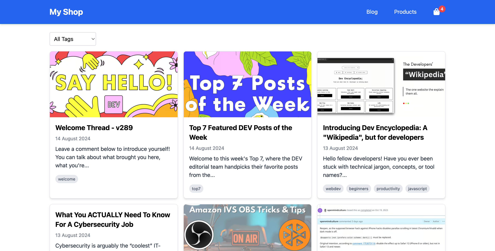
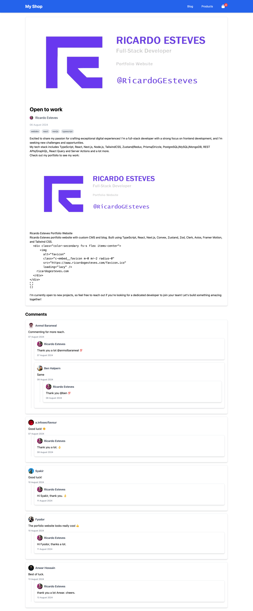
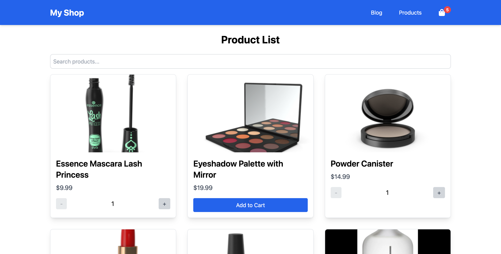
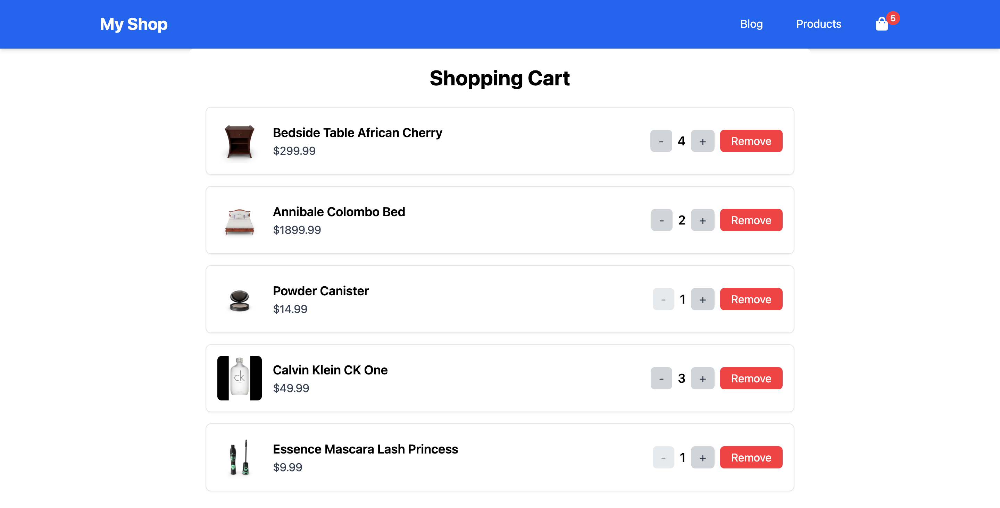

## Instructions

1. **Clone the Repository**
  - Clone this repository to your local machine.
  - Install dependencies with `npm install` or `yarn install`.

2. **Run the Project**
  - Start the development server with `npm run dev` or `yarn dev`.
  - Open your browser and navigate to `http://localhost:3000`.

----

## Challenge 1: Blog Post with Comments

### 1. **Project Setup**
- **API**: Dev.to API for blog posts and comments
- **Features**:
    - **List of Blog Posts**: Display a paginated list of blog posts with lazy loading.
    - **Post Detail Page**: Show detailed information about a selected blog post, including the cover image, title, tags, author, and content.
    - **Comments Section**: Display comments related to the blog post, including nested comments.
    - **Tag Filtering**: Filter blog posts by tags. Display only the top 10 tags from the API.

### 2. **Implementation Details**

#### **Blog Post List**
- **API Endpoint**: `https://dev.to/api/articles`
- **Route**: `/blog`
- **Features**:
    - List posts in a card format.
    - Each card should display the cover image, title, author, and tags.
    - Implement lazy loading for the list.
    - Use Tailwind CSS for styling.
    - Tags should be displayed and filterable.
- **Reference**
  

#### **Post Detail Page**
- **API Endpoint**: `https://dev.to/api/articles/{id}`
- **Route**: `/blog/{id}`
- **Features**:
    - Display the cover image (full height), title, published date, author information, and content of the post.
    - Show tags associated with the post.
    - Display comments for the post from `https://dev.to/api/comments?a_id={id}`.
    - Comments should support nesting and display the author’s profile image, name, and comment content.
- **Reference**
      

### 3. Evaluation Criteria

#### **Functionality**
- **Blog Post List**:
    - Correctly fetch and display a paginated list of blog posts.
    - Implement lazy loading for additional posts.
    - Filter posts by tags, showing only the top 10 tags from the API.

- **Post Detail Page**:
    - Properly fetch and display details for a selected blog post.
    - Show comments in a nested format, if applicable.

#### **Code Quality**
- **Code Organization**:
    - Code should be modular, well-organized, and adhere to best practices.
    - Components should be reusable and maintainable.

#### **Styling and Responsiveness**
- **Design**:
    - Follow modern design principles.
    - Ensure a clean and intuitive user interface.

#### **Performance**
- **Lazy Loading**:
    - Implement efficient lazy loading for blog posts to ensure good performance.

- **API Integration**:
    - Efficiently fetch and manage data from the API.
    - Minimize unnecessary re-renders and data fetching.

---

## Challenge 2: Shopping Cart Functionality

### 1. **Project Setup**
- **API**: DummyJSON API for product data
- **Features**:
    - **Product List**: Display a list of products with infinite scrolling and search functionality.
    - **Cart**: Implement a shopping cart that allows adding, removing, and updating product quantities.
    - **Local Storage**: Persist cart items in local storage.
    - **Navigation Bar**: Provide navigation between the product list and cart pages.

### 2. **Implementation Details**

#### **Product List**
- **API Endpoint**: `https://dummyjson.com/products`, `https://dummyjson.com/products/search?q=keyword`
- **Route**: `/shop`
- **Features**:
    - List products in a card format.
    - Each card should display the product image, title, price, and an add-to-cart button.
    - Implement infinite scrolling to load more products as the user scrolls down.
    - Implement a search feature with debounce to filter products based on user input.
- **Reference**
  

#### **Cart**
- **Route**: `/shop/cart`
- **Features**:
    - Display a list of products in the cart with their quantities.
    - Implement buttons to increase or decrease product quantities.
    - Allow removal of products from the cart.
    - Persist cart items in local storage.
    - Show a cart icon with a badge indicating the number of items in the cart.
- **Reference**
  

#### **Navigation Bar**
- **Features**:
    - A navigation bar to toggle between the Product List page and the Cart page.
    - Display the cart icon with a badge showing the number of items in the cart.

### 3. **Evaluation Criteria**

#### **Functionality**
- **Product List**:
    - Correctly fetch and display a list of products with infinite scrolling and search functionality.
    - Ensure products are displayed in a card format with correct product details.

- **Cart**:
    - Implement add, update, and remove functionality for cart items.
    - Ensure cart data is persisted in local storage and reflected accurately in the UI.
    - Display a cart icon with a badge showing the total number of items.

- **Navigation Bar**:
    - Provide seamless navigation between the product list and cart pages.
    - Ensure the cart icon and badge are updated correctly based on the cart's state.

#### **Code Quality**
- **Code Organization**:
    - Code should be modular, well-organized, and adhere to best practices.
    - Components should be reusable and maintainable.

#### **Styling and Responsiveness**
- **Design**:
    - Follow modern design principles.
    - Ensure a clean and intuitive user interface.

#### **Performance**
- **Debounce**:
    - Efficiently implement debounce to optimize the search functionality and reduce API request frequency.

- **Local Storage**:
    - Ensure efficient handling of cart data to prevent unnecessary re-renders and data fetching.

---

## Additional Notes

- Make sure project can run without issues and ensure that it functions as expected.
- Please submit finished challenge within specified deadline before.
- Send zipped project to email `edbert@evore.id` with title `Frontend Challenge Result {Fullname}`

If you encounter any issues or have questions, please reach out to `edbert@evore.id`
